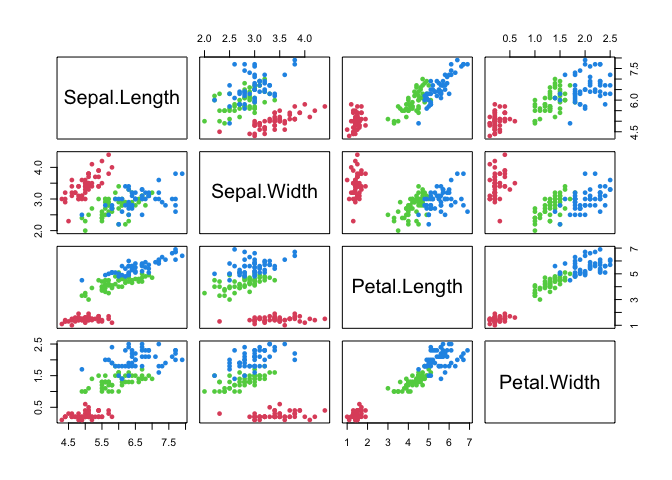
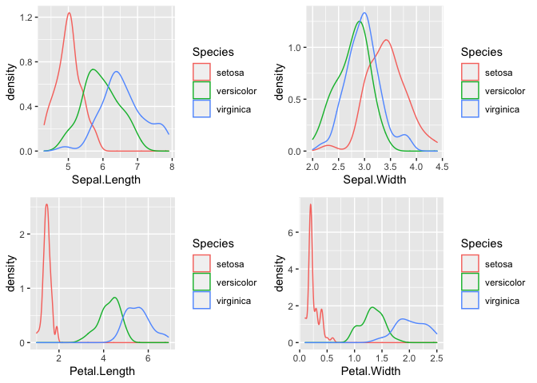

The Iris Dataset
================
Trevor Preston

### Exploratory Data Analysis

``` r
dim(iris)
```

    ## [1] 150   5

``` r
colnames(iris)
```

    ## [1] "Sepal.Length" "Sepal.Width"  "Petal.Length" "Petal.Width"  "Species"

``` r
head(iris)
```

    ##   Sepal.Length Sepal.Width Petal.Length Petal.Width Species
    ## 1          5.1         3.5          1.4         0.2  setosa
    ## 2          4.9         3.0          1.4         0.2  setosa
    ## 3          4.7         3.2          1.3         0.2  setosa
    ## 4          4.6         3.1          1.5         0.2  setosa
    ## 5          5.0         3.6          1.4         0.2  setosa
    ## 6          5.4         3.9          1.7         0.4  setosa

``` r
str(iris)
```

    ## 'data.frame':    150 obs. of  5 variables:
    ##  $ Sepal.Length: num  5.1 4.9 4.7 4.6 5 5.4 4.6 5 4.4 4.9 ...
    ##  $ Sepal.Width : num  3.5 3 3.2 3.1 3.6 3.9 3.4 3.4 2.9 3.1 ...
    ##  $ Petal.Length: num  1.4 1.4 1.3 1.5 1.4 1.7 1.4 1.5 1.4 1.5 ...
    ##  $ Petal.Width : num  0.2 0.2 0.2 0.2 0.2 0.4 0.3 0.2 0.2 0.1 ...
    ##  $ Species     : Factor w/ 3 levels "setosa","versicolor",..: 1 1 1 1 1 1 1 1 1 1 ...

``` r
iris %>% 
  select_if(is.numeric) %>% 
  plot(col = as.numeric(iris$Species)+1, pch = 16)
```

<!-- -->

``` r
g1 <- ggplot(iris, aes(Sepal.Length, col = Species)) + geom_density()
g2 <- ggplot(iris, aes(Sepal.Width, col = Species)) + geom_density()
g3 <- ggplot(iris, aes(Petal.Length, col = Species)) + geom_density()
g4 <- ggplot(iris, aes(Petal.Width, col = Species)) + geom_density()

grid.arrange(g1, g2, g3, g4, nrow = 2, ncol = 2)
```

<!-- -->

# End
