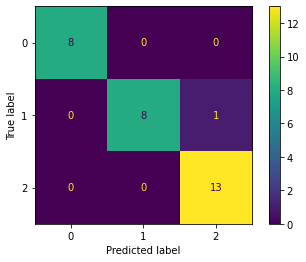

# Trevor Preston - Code Sample

This is small classification example but upon request I can provide code for other types of data (geostatistics, time-series, etc.)


```python
# ----------------------------
# Trevor Preston - Data Analyst
# tdpreston@gmail.com
# (805)-551-8525
# ----------------------------
```


```python
# -----------------------------
# Import packages
# -----------------------------

import numpy as np
import pandas as pd

# plotting
import matplotlib.pyplot as plt
import seaborn as sns

# sklearn
from sklearn import datasets
from sklearn.model_selection import KFold
from sklearn import metrics
from sklearn.model_selection import train_test_split
```


```python
# -----------------------------
# Load Data
# -----------------------------

iris = datasets.load_iris()

# Convert data to pandas DataFrame

idf = pd.DataFrame(iris.data)

idf.columns = iris.feature_names

idf['species'] = iris.target

idf.head(5)
```


<div>
<style scoped>
    .dataframe tbody tr th:only-of-type {
        vertical-align: middle;
    }

    .dataframe tbody tr th {
        vertical-align: top;
    }

    .dataframe thead th {
        text-align: right;
    }
</style>
<table border="1" class="dataframe">
  <thead>
    <tr style="text-align: right;">
      <th></th>
      <th>sepal length (cm)</th>
      <th>sepal width (cm)</th>
      <th>petal length (cm)</th>
      <th>petal width (cm)</th>
      <th>species</th>
    </tr>
  </thead>
  <tbody>
    <tr>
      <th>0</th>
      <td>5.1</td>
      <td>3.5</td>
      <td>1.4</td>
      <td>0.2</td>
      <td>0</td>
    </tr>
    <tr>
      <th>1</th>
      <td>4.9</td>
      <td>3.0</td>
      <td>1.4</td>
      <td>0.2</td>
      <td>0</td>
    </tr>
    <tr>
      <th>2</th>
      <td>4.7</td>
      <td>3.2</td>
      <td>1.3</td>
      <td>0.2</td>
      <td>0</td>
    </tr>
    <tr>
      <th>3</th>
      <td>4.6</td>
      <td>3.1</td>
      <td>1.5</td>
      <td>0.2</td>
      <td>0</td>
    </tr>
    <tr>
      <th>4</th>
      <td>5.0</td>
      <td>3.6</td>
      <td>1.4</td>
      <td>0.2</td>
      <td>0</td>
    </tr>
  </tbody>
</table>
</div>


```python
for i in range(3):
    print(iris.target_names[i], "=", i)
```

    setosa = 0
    versicolor = 1
    virginica = 2


## Summary Statistics


```python
idf.iloc[:,:4].describe()
```


<div>
<style scoped>
    .dataframe tbody tr th:only-of-type {
        vertical-align: middle;
    }

    .dataframe tbody tr th {
        vertical-align: top;
    }

    .dataframe thead th {
        text-align: right;
    }
</style>
<table border="1" class="dataframe">
  <thead>
    <tr style="text-align: right;">
      <th></th>
      <th>sepal length (cm)</th>
      <th>sepal width (cm)</th>
      <th>petal length (cm)</th>
      <th>petal width (cm)</th>
    </tr>
  </thead>
  <tbody>
    <tr>
      <th>count</th>
      <td>150.000000</td>
      <td>150.000000</td>
      <td>150.000000</td>
      <td>150.000000</td>
    </tr>
    <tr>
      <th>mean</th>
      <td>5.843333</td>
      <td>3.057333</td>
      <td>3.758000</td>
      <td>1.199333</td>
    </tr>
    <tr>
      <th>std</th>
      <td>0.828066</td>
      <td>0.435866</td>
      <td>1.765298</td>
      <td>0.762238</td>
    </tr>
    <tr>
      <th>min</th>
      <td>4.300000</td>
      <td>2.000000</td>
      <td>1.000000</td>
      <td>0.100000</td>
    </tr>
    <tr>
      <th>25%</th>
      <td>5.100000</td>
      <td>2.800000</td>
      <td>1.600000</td>
      <td>0.300000</td>
    </tr>
    <tr>
      <th>50%</th>
      <td>5.800000</td>
      <td>3.000000</td>
      <td>4.350000</td>
      <td>1.300000</td>
    </tr>
    <tr>
      <th>75%</th>
      <td>6.400000</td>
      <td>3.300000</td>
      <td>5.100000</td>
      <td>1.800000</td>
    </tr>
    <tr>
      <th>max</th>
      <td>7.900000</td>
      <td>4.400000</td>
      <td>6.900000</td>
      <td>2.500000</td>
    </tr>
  </tbody>
</table>
</div>


```python
for i in range(3):
    print('-----------------------------------')
    print("species: ", iris.target_names[i])
    for j in range(4):
        print(idf.query('species == @i').iloc[:,j].describe())
        print('\n')
    print('-----------------------------------')
    print('\n')
```

    -----------------------------------
    species:  setosa
    count    50.00000
    mean      5.00600
    std       0.35249
    min       4.30000
    25%       4.80000
    50%       5.00000
    75%       5.20000
    max       5.80000
    Name: sepal length (cm), dtype: float64
    
    
    count    50.000000
    mean      3.428000
    std       0.379064
    min       2.300000
    25%       3.200000
    50%       3.400000
    75%       3.675000
    max       4.400000
    Name: sepal width (cm), dtype: float64
    
    
    count    50.000000
    mean      1.462000
    std       0.173664
    min       1.000000
    25%       1.400000
    50%       1.500000
    75%       1.575000
    max       1.900000
    Name: petal length (cm), dtype: float64
    
    
    count    50.000000
    mean      0.246000
    std       0.105386
    min       0.100000
    25%       0.200000
    50%       0.200000
    75%       0.300000
    max       0.600000
    Name: petal width (cm), dtype: float64
    
    
    -----------------------------------
    
    
    -----------------------------------
    species:  versicolor
    count    50.000000
    mean      5.936000
    std       0.516171
    min       4.900000
    25%       5.600000
    50%       5.900000
    75%       6.300000
    max       7.000000
    Name: sepal length (cm), dtype: float64
    
    
    count    50.000000
    mean      2.770000
    std       0.313798
    min       2.000000
    25%       2.525000
    50%       2.800000
    75%       3.000000
    max       3.400000
    Name: sepal width (cm), dtype: float64
    
    
    count    50.000000
    mean      4.260000
    std       0.469911
    min       3.000000
    25%       4.000000
    50%       4.350000
    75%       4.600000
    max       5.100000
    Name: petal length (cm), dtype: float64
    
    
    count    50.000000
    mean      1.326000
    std       0.197753
    min       1.000000
    25%       1.200000
    50%       1.300000
    75%       1.500000
    max       1.800000
    Name: petal width (cm), dtype: float64
    
    
    -----------------------------------
    
    
    -----------------------------------
    species:  virginica
    count    50.00000
    mean      6.58800
    std       0.63588
    min       4.90000
    25%       6.22500
    50%       6.50000
    75%       6.90000
    max       7.90000
    Name: sepal length (cm), dtype: float64
    
    
    count    50.000000
    mean      2.974000
    std       0.322497
    min       2.200000
    25%       2.800000
    50%       3.000000
    75%       3.175000
    max       3.800000
    Name: sepal width (cm), dtype: float64
    
    
    count    50.000000
    mean      5.552000
    std       0.551895
    min       4.500000
    25%       5.100000
    50%       5.550000
    75%       5.875000
    max       6.900000
    Name: petal length (cm), dtype: float64
    
    
    count    50.00000
    mean      2.02600
    std       0.27465
    min       1.40000
    25%       1.80000
    50%       2.00000
    75%       2.30000
    max       2.50000
    Name: petal width (cm), dtype: float64
    
    
    -----------------------------------
    
    


## Exploratory Data Analysis


```python
# Pairplot

sns.pairplot(idf, hue='species', palette='Set2')
```


    <seaborn.axisgrid.PairGrid at 0x7f98ece8cca0>


    

    


```python
# Boxplot

sns.boxplot(x="species", y="petal width (cm)",
            hue="species", palette='Set2',
            data=idf)
```


    <AxesSubplot:xlabel='species', ylabel='petal width (cm)'>


    

    


```python
# Scatterplot with regression lines

sns.lmplot(data=idf,
    x="petal length (cm)", y="petal width (cm)", hue="species",
    palette='Set2', height=5
)
```


    <seaborn.axisgrid.FacetGrid at 0x7f98ee0ba370>


    

    


## Classification techniques


```python
# Split up data

X = idf.iloc[:,:4]
y = idf.iloc[:,4]

# set up k-fold, k = 5

kf = KFold(n_splits=5, shuffle=True, random_state=24)
```

### LDA and QDA


```python
# LDA

from sklearn.discriminant_analysis import LinearDiscriminantAnalysis

lda = LinearDiscriminantAnalysis()

acc = [] # accuracy array

for i, (itr, its) in enumerate(kf.split(X)):
    Xtr, Xts = X.iloc[itr,:], X.iloc[its,:]
    ytr, yts = y[itr], y[its]
    
    lda.fit(Xtr, ytr)
    prd = lda.predict(Xts)
    print("Fold", i+1, " Accuracy:", metrics.accuracy_score(prd, yts))
    acc.append(metrics.accuracy_score(prd, yts))

print("Mean Accuracy:", round(np.mean(acc), 3))
```

    Fold 1  Accuracy: 1.0
    Fold 2  Accuracy: 0.9666666666666667
    Fold 3  Accuracy: 1.0
    Fold 4  Accuracy: 0.9666666666666667
    Fold 5  Accuracy: 0.9666666666666667
    Mean Accuracy: 0.98


```python
# Train, test (no fold)

Xtr, Xts, ytr, yts = train_test_split(X, y, test_size=.33, random_state=24)

print("Accuracy:", metrics.accuracy_score(lda.predict(Xts), yts))

metrics.plot_confusion_matrix(lda, Xts, yts)
plt.show()
```

    Accuracy: 0.98


    

    


```python
# QDA

from sklearn.discriminant_analysis import QuadraticDiscriminantAnalysis

qda = QuadraticDiscriminantAnalysis()

acc = [] # accuracy array

for i, (itr, its) in enumerate(kf.split(X)):
    Xtr, Xts = X.iloc[itr,:], X.iloc[its,:]
    ytr, yts = y[itr], y[its]
    
    qda.fit(Xtr, ytr)
    prd = qda.predict(Xts)
    print("Fold", i+1, " Accuracy:", metrics.accuracy_score(prd, yts))
    acc.append(metrics.accuracy_score(prd, yts))

print("Mean Accuracy:", round(np.mean(acc), 3))
```

    Fold 1  Accuracy: 1.0
    Fold 2  Accuracy: 0.9666666666666667
    Fold 3  Accuracy: 1.0
    Fold 4  Accuracy: 0.9666666666666667
    Fold 5  Accuracy: 0.9666666666666667
    Mean Accuracy: 0.98


```python
# Train, test (no fold)

print("Accuracy:", metrics.accuracy_score(qda.predict(Xts), yts))

metrics.plot_confusion_matrix(qda, Xts, yts)
plt.show()
```

    Accuracy: 0.9666666666666667


    

    


### SVM


```python
from sklearn import svm

sv1 = svm.SVC()

acc = [] # accuracy array

for i, (itr, its) in enumerate(kf.split(X)):
    Xtr, Xts = X.iloc[itr,:], X.iloc[its,:]
    ytr, yts = y[itr], y[its]
    
    sv1.fit(Xtr, ytr)
    prd = sv1.predict(Xts)
    print("Fold", i+1, " Accuracy:", metrics.accuracy_score(prd, yts))
    acc.append(metrics.accuracy_score(prd, yts))

print("Mean Accuracy:", round(np.mean(acc), 3))
```

    Fold 1  Accuracy: 1.0
    Fold 2  Accuracy: 0.9666666666666667
    Fold 3  Accuracy: 1.0
    Fold 4  Accuracy: 0.9333333333333333
    Fold 5  Accuracy: 1.0
    Mean Accuracy: 0.98


```python
# Train, test (no fold)

print("Accuracy:", metrics.accuracy_score(sv1.predict(Xts), yts))

metrics.plot_confusion_matrix(sv1, Xts, yts)
plt.show()
```

    Accuracy: 1.0


    

    


### KNN


```python
from sklearn.neighbors import KNeighborsClassifier

knn = KNeighborsClassifier(n_neighbors=3)

acc = [] # accuracy array

for i, (itr, its) in enumerate(kf.split(X)):
    Xtr, Xts = X.iloc[itr,:], X.iloc[its,:]
    ytr, yts = y[itr], y[its]
    
    knn.fit(Xtr, ytr)
    prd = knn.predict(Xts)
    print("Fold", i+1, " Accuracy:", metrics.accuracy_score(prd, yts))
    acc.append(metrics.accuracy_score(prd, yts))

print("Mean Accuracy:", round(np.mean(acc), 3))
```

    Fold 1  Accuracy: 0.9666666666666667
    Fold 2  Accuracy: 0.9666666666666667
    Fold 3  Accuracy: 1.0
    Fold 4  Accuracy: 0.9333333333333333
    Fold 5  Accuracy: 0.9333333333333333
    Mean Accuracy: 0.96


```python
# Train, test (no fold)

print("Accuracy:", metrics.accuracy_score(knn.predict(Xts), yts))

metrics.plot_confusion_matrix(knn, Xts, yts)
plt.show()
```

    Accuracy: 0.9333333333333333


    

    


### Neural Network


```python
from sklearn.neural_network import MLPClassifier

# The hidden layer size was arbitrarily chosen but could be optimized to find
# the ideal hidden layer size as well as trying different options in various parameters

nn = MLPClassifier(solver='lbfgs', alpha=1e-5, 
                    hidden_layer_sizes=(50,2), random_state=24)

acc = [] # accuracy array

for i, (itr, its) in enumerate(kf.split(X)):
    Xtr, Xts = X.iloc[itr,:], X.iloc[its,:]
    ytr, yts = y[itr], y[its]
    
    nn.fit(Xtr, ytr)
    prd = nn.predict(Xts)
    print("Fold", i+1, " Accuracy:", metrics.accuracy_score(prd, yts))
    acc.append(metrics.accuracy_score(prd, yts))

print("Mean Accuracy:", round(np.mean(acc), 3))
```

    Fold 1  Accuracy: 1.0
    Fold 2  Accuracy: 1.0
    Fold 3  Accuracy: 1.0
    Fold 4  Accuracy: 0.9666666666666667
    Fold 5  Accuracy: 0.9333333333333333
    Mean Accuracy: 0.98


```python
# Train, test (no fold)

print("Accuracy:", metrics.accuracy_score(nn.predict(Xts), yts))

metrics.plot_confusion_matrix(nn, Xts, yts)
plt.show()
```

    Accuracy: 0.9333333333333333


    

    


```python
# End
```
